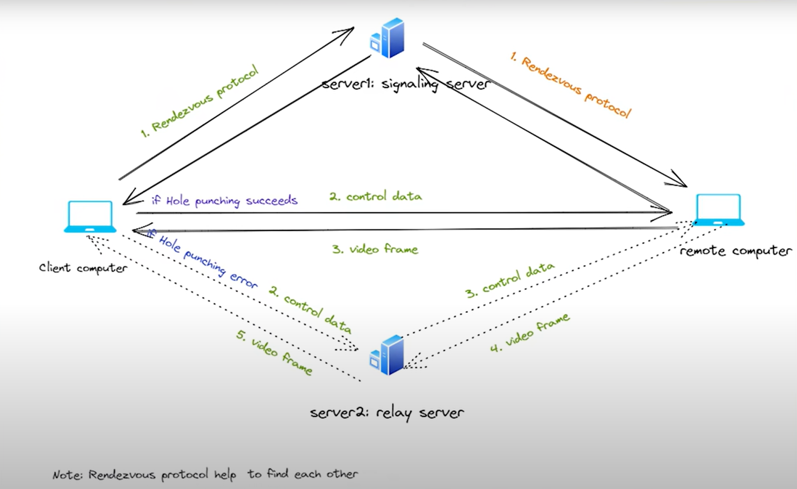

## Remote Desktop 

### Browser based
- Guacamooe
- Kasm vnc - VNC are difficult to configure, specially on linux


### Teamviewer like 
- Anydesk
    - Server paid
- RustDesk
    - Open source 
    - Local server free
    - 🖥️ Download RustDesk: https://rustdesk.com
    - 🐬Install Docker: https://docs.docker.com/engine/install/
    - 📦 Self-Hosting RustDesk (Docker Guide): https://rustdesk.com/docs/en/self-host/rustdesk-server-oss/docker/
    - 🐧 RustDesk Headless Linux Support: https://github.com/rustdesk/rustdesk/wiki/Headless-Linux-Support

### Setting the relay and ID server 
- Whe docker compose is up it will create a data folder with the private and public key 
    - grab the pubvlic key to be used in the relay server, all before the email
    ```bash
    cat id_ed25519.pub
    ```
- Within RustDesk Go to Network
    - Id/relay server 





### Twingate 
- Zero trust network access easy to deploy
- 5 users Free
- 

https://ntck.co/twingate_zerotrust 